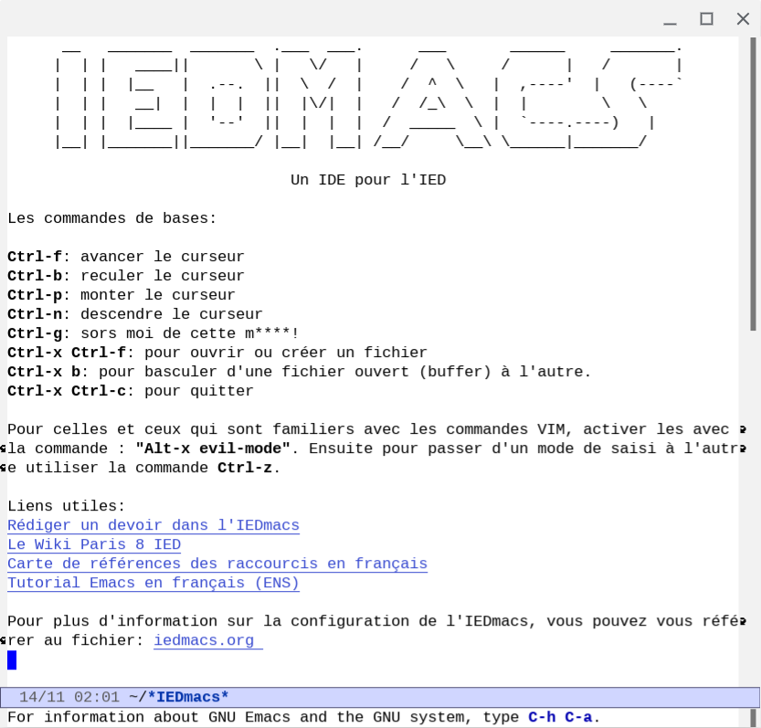

_(Ce sont des informations sommaires. Pour plus d'information et de
détails voir le fichier `iedmacs.org`)_



# Aide pour Utiliser Emacs et Rendre les Devoirs de l'IED

Pour une assistance à la prise en main d'Emacs et pour rendre les devoirs de l'IED, voici trois fichiers qui pourront être utiles :

- `init.el` : Fichier de configuration pour IEDmacs, à placer dans le répertoire `~/.emacs.d`.
- `ied-latex-standard.org` : Fichier de configuration pour l'export en latex et PDF.
- `iedmacs.org` : Le manuel d'IEDmacs.

## Installation

Pour utiliser Emacs et LaTex :

1. Installer Emacs
    ```bash
    $ sudo apt-get install emacs
    ``` 
2. Installer LaTeX
    ```bash
    $ sudo apt-get install texlive-full
    ```
3. Télécharger les fichiers de ce dépôt
   ```bash
   for file in init.el ied-latex-standard.org iedmacs.org; do curl -o ~/.emacs.d/$file https://raw.githubusercontent.com/AreTaro/iedmacs/main/$file; done
   ```
4. Lancer Emacs
    ```shell
    $ emacs &
    ```

## Les Commandes

Il est conseillé de parcourir le tutoriel pour apprendre les commandes
de base. Sinon, voici quelques commandes de base :

- `Ctrl-g` : pour sortir d'un combo de commandes (souvent utile)
- `Ctrl-f`, `Ctrl-b`, `Ctrl-p`, `Ctrl-n` : pour avancer, reculer, monter, descendre le curseur respectivement.
- `Ctrl-x Ctrl-f` : pour ouvrir un fichier
- `Ctrl-x Ctrl-s` : pour sauvegarder
- `Ctrl-x Ctrl-c` : pour quitter

## Rédiger un Devoir

Pour soumettre un devoir en utilisant Org-mode, suivez ces étapes :

1. Cliquer sur le lien "Rédiger un devoir avec l'IEDmacs", et
enregistrer le document sous le répertoire et le nom de votre choix
avec la commande `Ctrl-x Ctrl-s`.

2. Modifiez l'en-tête du document avec les
informations du cours et les vôtres, ainsi que le chemin d'accès au
fichier `ied-latex-standard.org` copié précédemment :

```org-mode
#+TITLE: [NOM DU CHAPITRE]
#+SUBTITLE: [NOM DU COURS]
#+OPTIONS: toc:t author:nil
#+LaTeX_HEADER: \author{[PRENOM NOM] \\ N. Etudiant : [NUMERO]}
#+SETUPFILE: ~/[CHEMIN]/ied-latex-standard.org
```

3. Rédigez votre devoir en dessous de la marque "New page" en
utilisant la notation Org-mode.

4. Exportez votre devoir en PDF en utilisant la commande `Ctrl-c
Ctrl-e l p`. Votre devoir est prêt.

Le format n'est pas standard et peut être modifié en fonction des
besoins et préférences.

## Coopérer à l'IEDmacs

Créer un fork du dépôt et modifier sur la branche développement avec
la fonction que vous souhaitez ajouter ou modifier.

Prochains ajouts prévus:
- ~pdf-tools pour lire et annoter les documents pdf~
- gptel pour utiliser Chat-GPT directement dans l'IDEmacs
- mu4 pour lire les mails de l'ied dans l'IEDmacs
- ajout du modèle latex TexIED8 de amartos
- ajout du package `which-key` pour afficher un menu
